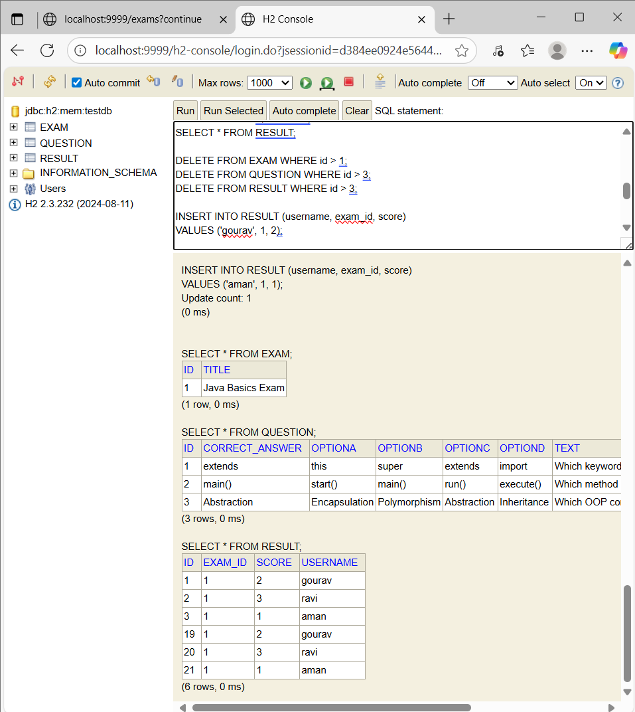
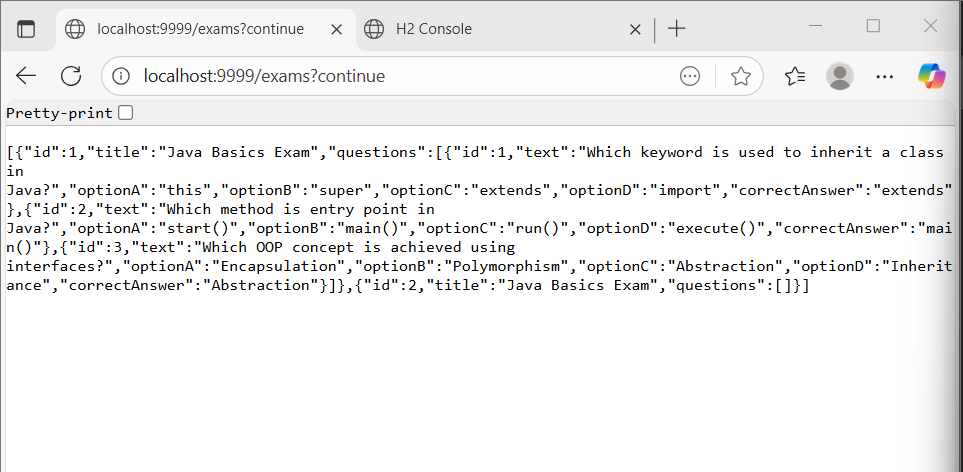

# Online Examination System

I built this small Spring Boot project for managing online exams. It includes basic authentication (Spring Security), exam creation, question management, and result processing. The app uses an H2 in-memory database for demo purposes.

---

# What this repo contains

* Spring Boot backend (REST API)
* Entities: `Exam`, `Question`, `Result`
* Basic authentication using Spring Security (in-memory user)
* H2 console enabled for quick database checks

---

# Quick features

* Create exams with multiple-choice questions
* Submit answers and store results
* View all exams and results via REST endpoints
* H2 Console for manual data insert / inspection

---

# Tech stack

* Java 21
* Spring Boot 3
* Spring Data JPA
* Spring Security
* H2 Database (in-memory)

---

# How to run (local)

1. Clone the repo and open in IntelliJ or terminal:
   git clone https://github.com/<your-username>/online-examination-system.git
   cd online-examination-system

2. From terminal
./mvnw spring-boot:run
Or run ExamApplication.java from IntelliJ.

3. By default, the app runs on port 9999 (this can be changed in application.properties).

# Useful URLs
API: http://localhost:9999/exams
H2 Console: http://localhost:9999/h2-console (JDBC URL: jdbc:h2:mem:testdb, user: sa, password: blank)

Default login (Spring Security)
username: user
password: password

Example API endpoints

* GET /exams → list all exams (with questions)
* POST /exams → create an exam (JSON body)
* POST /exams/{id}/submit → submit answers and save result
* GET /exams/results → list all results

Example POST to submit (JSON):
```json
{
"username": "gourav",
"answers": [
{ "questionId": 1, "answer": "extends" },
{ "questionId": 2, "answer": "main()" }
]
}
```

SQL Query (H2 Console)
Run these in H2 console to add demo data:

```sql

INSERT INTO EXAM (title) VALUES ('Java Basics Exam');

INSERT INTO QUESTION (text, optionA, optionB, optionC, optionD, correct_answer, exam_id)
VALUES ('Which keyword is used to inherit a class in Java?', 'this', 'super', 'extends', 'import', 'extends', 1);

INSERT INTO RESULT (username, exam_id, score)
VALUES ('gourav', 1, 2);

```

* Author:- Gourav  
* This project is part of my learning journey with Spring Boot.*
## Screenshots

### 1. Exam API Response


### 2. H2 Database Console



